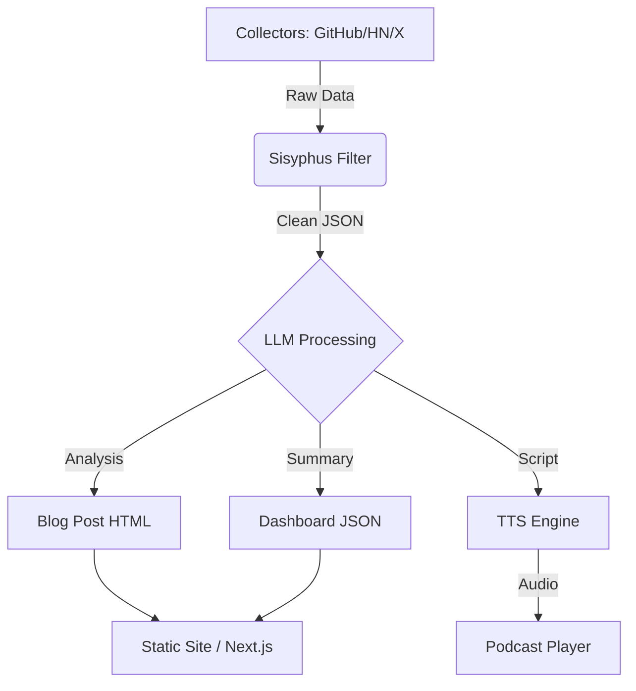

# Company Dashboard - Requirements & Architecture

## 1. Project Overview
**Mission**: To be the central nervous system of Ninjin Super Company, visualizing AI intelligence, survival verdicts, and personal insights in real-time.
**Target Audience**: 
1. **Primary**: Ninjin (CEO) for decision making.
2. **Public**: Tech community interested in filtered, high-density AI insights (MVP Launch).

## 2. Core Features (MVP)

### 2.1 "Toxic Geek" Intelligence Feed (Daily)
- **Source**: Automated aggregation from GitHub, Hacker News, X, Xiaohongshu.
- **Processing**: Sisyphus agents filter noise -> LLM rewrites in "Toxic Geek" persona.
- **Display**: 
  - **Deep Dive (1-2/day)**: In-depth analysis card with "Verdict".
  - **Briefs (5-8/day)**: Quickfire news list.
  - **Tags**: [Real Code], [Demo Only], [Vaporware], [Game Changer].

### 2.2 Podcast Module ("The Ninjin Clone")
- **Audio Engine**: Qwen3-TTS via MCP Bridge.
- **Format**:
  - **Daily Briefing (10-15 min)**: Rapid fire run-through of the day's briefs.
  - **Weekly Deep Dive (30-40 min)**: Detailed breakdown of one major topic.
- **UI**: Embedded audio player with waveform visualizer (Remotion-style aesthetics).

### 2.3 Knowledge Knowledge Graph (Verdicts)
- **Survival Verdicts**: Tracking framework lifecycles (e.g., "MCP" vs "LangChain").
- **Status**: [Evolution], [Stagnant], [Dead].
- **Visual**: A living "Graveyard vs Garden" dashboard.

## 3. Technical Architecture

### 3.1 Data Flow

### 3.2 Tech Stack
- **Frontend**: HTML5 + Tailwind CSS (Current) -> Next.js (Future Upgrade).
- **Data**: `data.json` (MVP) -> Supabase (Production).
- **Build**: Automated scripts (`daily_engine.js`) triggered by Cron.
- **Deploy**: Vercel (Static/Edge) or GitHub Pages.

## 4. User Experience (UX) Goals
- **Information Density**: High. No fluff.
- **Visual Style**: "Laboratory / Cyber-Minimalism". White/Black/Purple.
- **Interaction**: Fast, clickable verdicts, seamless audio playback.

## 5. Public Launch Checklist
- [ ] Mobile Responsiveness (Critical).
- [ ] SEO Metadata (OpenGraph tags for sharing).
- [ ] RSS Feed generation for Podcast & Blog.
- [ ] "Subscribe" feature (Email capture via ConvertKit or similar).
